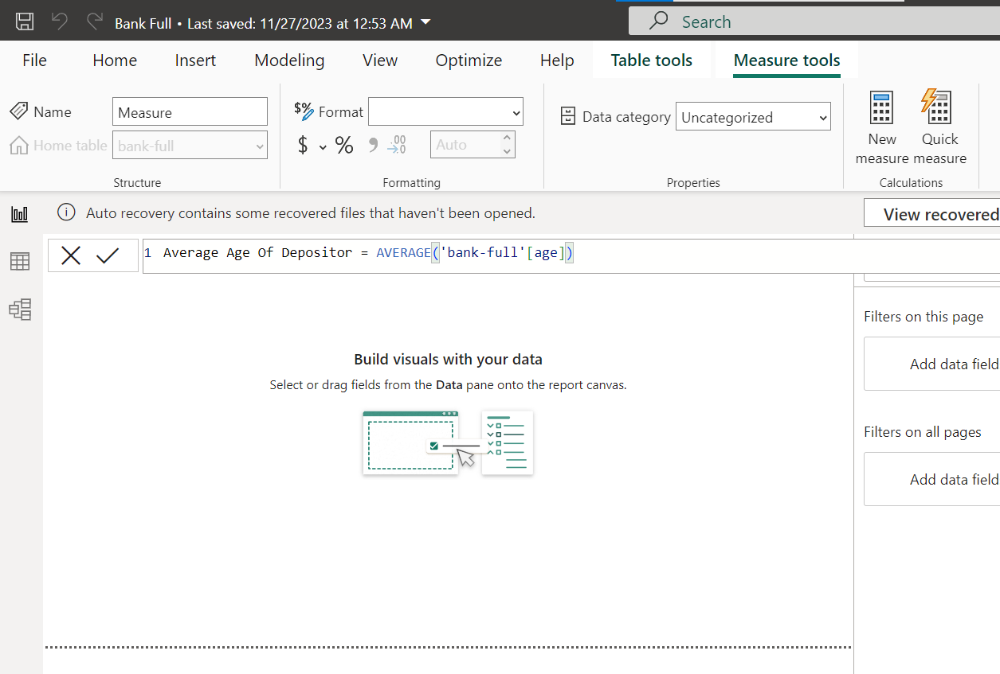
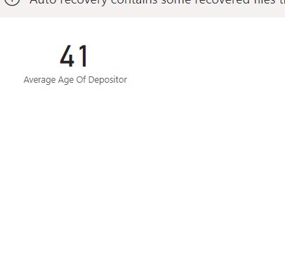
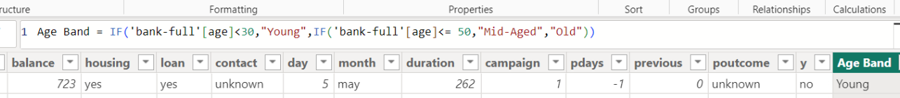
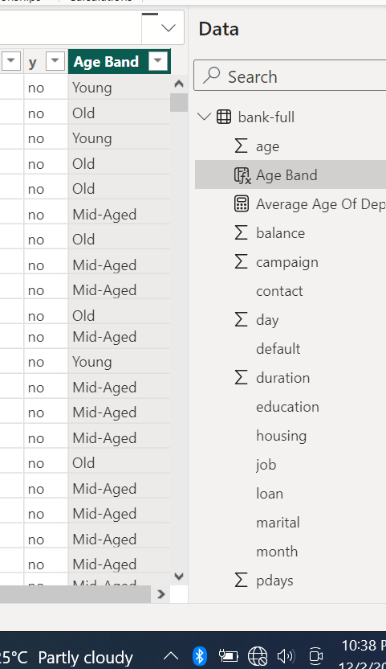
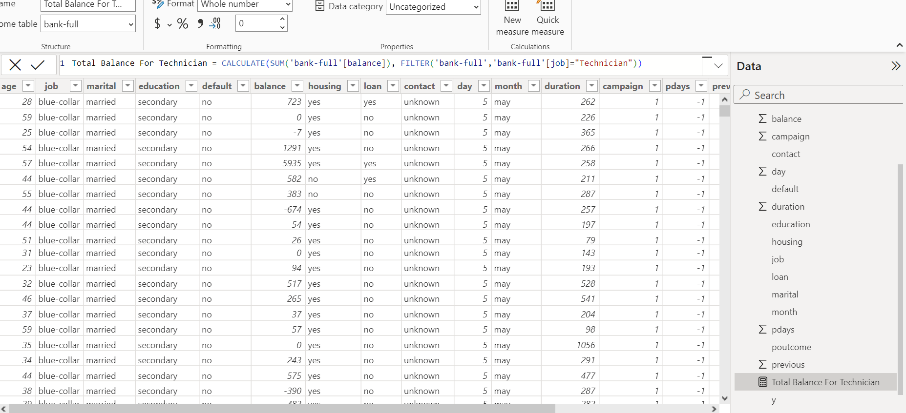
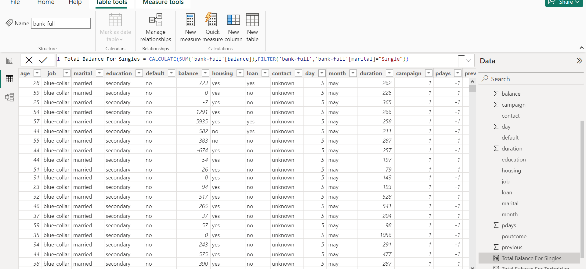
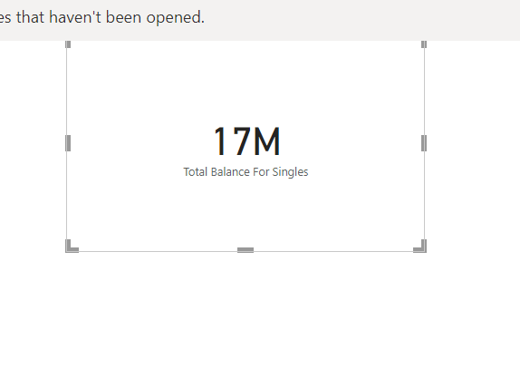
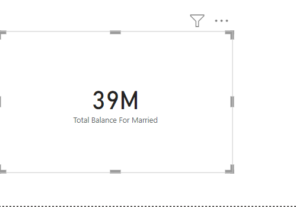

# Bank Term Deposit Subscription Dax

## Introduction

In this Power Bi Task, We were Provided with a Dataset called BankFull in CSV Format. The project is to learn how to calcuate DAX (Data Analysis expression).

**_Disclamier_**:_All Dataset do not represent any individual, Institution or company ,but just a dummy set to demonstrate my knowledge of Power Bi._

## Skill/ Concepts Documented
  - Dax

## Problem Statement
1. Create a measure for a 'Average Age of depositors'.
2. Create a new column named 'Age Band' containing the following;
  -  'Young' for ages below 30
  -  'Mid-Aged' For ages betweem 30 and 50
  -  'Old' for ages above 50
3. Create a new column calculating the total balance for;
   - Job: Technician
   - Marital: Single and Married
4. Create a measure to get the number of depositors on Loan.

# Problem Solved
1. Create a measure for a 'Average Age of depositors'.
 Average Age Of Depositor = AVERAGE('bank-full'[age])

Result = 41

2. Create a new column named 'Age Band'
Age Band = IF('bank-full'[age]<30,"Young",IF('bank-full'[age]<= 50,"Mid-Aged","Old"))

3. Create a new column calculating the total balance for;
   - Job: Technician
   Total Balance For Technician = CALCULATE(SUM('bank-full'[balance]), FILTER('bank-full','bank-full'[job]="Technician"))

   - Marital: Single and Married
  Single
Total Balance For Singles = CALCULATE(SUM('bank-full'[balance]),FILTER('bank-full','bank-full'[marital]="Single"))

Married
Total Balance For Married = CALCULATE(SUM('bank-full'[balance]),FILTER('bank-full','bank-full'[marital]="Married"))

   
   
